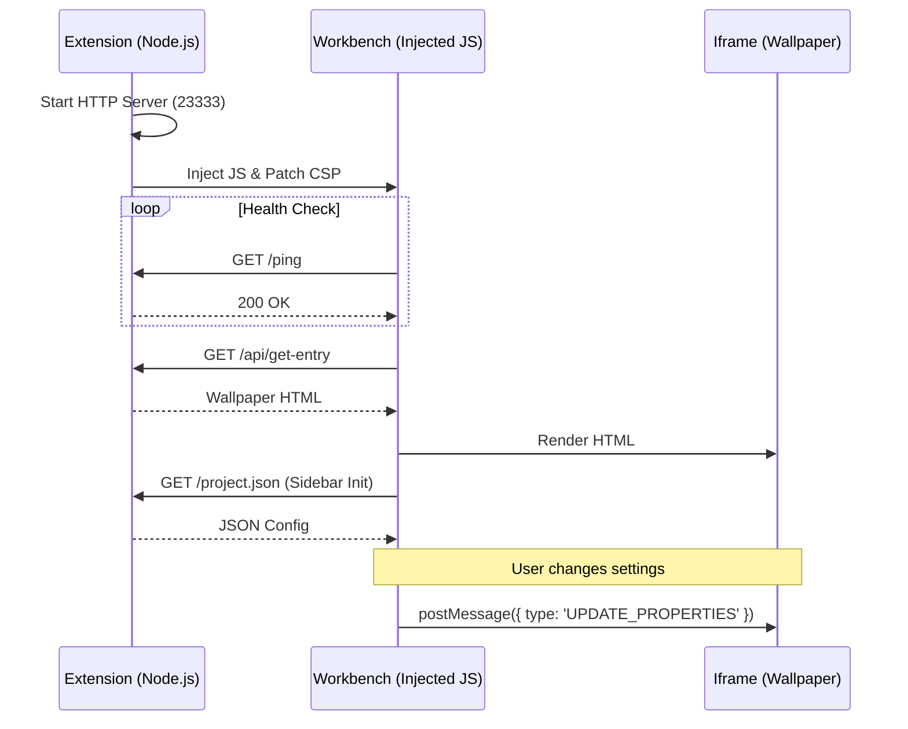

# VS Code Wallpaper Engine 通信机制文档

本文档详细说明了 `vscode-wallpaper-engine` 扩展中，VS Code 前端（Workbench）、壁纸服务（Server）与壁纸内容（Wallpaper）之间的通信架构。

## 1. 核心架构

整个系统由三个主要部分组成：

1.  **Extension Host (后端)**: 运行在 VS Code 扩展进程中的 Node.js 代码。负责启动本地 HTTP 服务器、管理壁纸资源、以及修改 VS Code 的核心文件。
2.  **Workbench (宿主环境)**: VS Code 的主窗口 (`workbench.html`)。通过注入的 JavaScript 代码运行壁纸容器。
3.  **Wallpaper (壁纸)**: 运行在 Workbench 内部 `iframe` 中的 Web 内容。

## 2. 通信流程

### 2.1 初始化与注入

1.  **启动服务**: 扩展激活时，`src/core/server.ts` 启动一个本地 HTTP 服务器（默认端口 23333）。
2.  **代码注入**: `src/core/injector.ts` 修改 VS Code 安装目录下的 `workbench.html` 和 `workbench.desktop.main.js`。
    - **CSP Patch**: 放宽 `Content-Security-Policy`，允许加载 `http://127.0.0.1:23333` 的资源。
    - **JS Injection**: 注入一段引导脚本，负责创建壁纸容器和侧边栏。

### 2.2 壁纸加载机制

注入的 JavaScript (`injectJs` 函数生成的代码) 执行以下步骤：

1.  **健康检查 (Health Check)**:

    - 脚本会轮询 `http://127.0.0.1:23333/ping`。
    - 如果服务器未就绪，会持续等待。
    - 一旦收到 `200 OK` 或 `205 Reset Content`，视为服务已启动。

2.  **创建容器**:

    - 在 VS Code 界面顶层创建一个 `div` (`#vscode-wallpaper-container`)。
    - 在其中创建一个 `iframe`。

3.  **加载内容**:
    - `iframe` 的 `srcdoc` 被设置为一段包含引导逻辑的 HTML。
    - 该引导逻辑通过 `fetch('http://127.0.0.1:23333/api/get-entry')` 获取实际的壁纸 HTML 内容。
    - 获取到的 HTML 被写入 `document`，壁纸开始运行。

### 2.3 设置面板 (Sidebar) 通信

注入的脚本还包含一个简易的侧边栏（Sidebar），用于调整壁纸参数。

1.  **获取配置**:

    - 侧边栏初始化时，请求 `http://127.0.0.1:23333/project.json`。
    - 该文件包含壁纸支持的属性（如颜色、速度等）。

2.  **应用设置**:
    - 当用户在侧边栏修改参数时，调用 `window.updateProp(key, value)`。
    - 该函数通过 `postMessage` 向 `iframe` 发送消息：
      ```javascript
      iframe.contentWindow.postMessage(
        {
          type: "UPDATE_PROPERTIES",
          data: { [key]: { value: val } },
        },
        "*"
      );
      ```
    - 壁纸内部的脚本（通常是 Wallpaper Engine 兼容层）接收消息并更新效果。

### 2.4 多实例与重载

- **重载信号**: 如果服务器需要客户端刷新（例如切换了壁纸），`/ping` 接口会返回 `205` 状态码。客户端脚本检测到 `205` 后，会重新获取壁纸内容并刷新 `iframe`。
- **多实例复用**: 新版服务器支持 `/status` 接口。启动时会检查端口是否被占用且路径是否一致，从而决定是复用现有服务还是重启服务。

## 3. 常见连接问题排查

如果出现“设置项连接不到服务器”的情况，通常是以下原因：

1.  **端口冲突**: 23333 端口被其他程序占用，导致服务未成功启动。
2.  **CSP 拦截**: `workbench.html` 的 CSP 补丁未生效（可能是 VS Code 更新覆盖了文件），导致浏览器阻止了对 `http://127.0.0.1` 的请求。
3.  **服务重启中**: 在多窗口切换时，旧服务正在关闭，新服务尚未就绪，此时前端发起的 `project.json` 请求可能失败。

## 4. 架构图示


